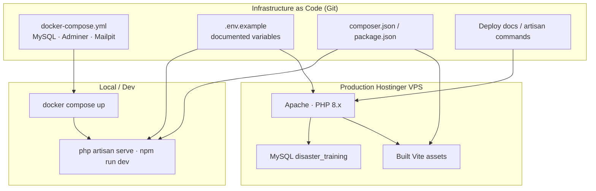

# Infrastructure as Code (IaC)

**System:** Disaster Preparedness Training & Simulation Platform  
**Status:** Draft ready for manuscript (unchecked → completed here)

---

## 1. What IaC means in this project

Infrastructure as Code means the **environment is declared in files** (versioned with Git) instead of only clicking through a hosting panel. For this capstone, IaC is applied at a practical level suitable for an LGU web platform:

| Layer | Code / config artifact | Purpose |
|-------|------------------------|---------|
| Local / team DB & tools | `my-app/docker-compose.yml` | MariaDB, Adminer, Mailpit — repeatable local stack |
| App runtime config | `.env` + `.env.example` | DB, URL, Gemini, Group 6, CPSQC keys (secrets not committed) |
| Web server (prod) | Hostinger Apache vhost / documented deploy steps | PHP app on VPS subdomain |
| Build pipeline inputs | `composer.json`, `package.json`, Vite config | Deterministic dependency install & asset build |
| Deploy runbook | `docs/GOING_LIVE_AND_DEPLOYMENT.md`, `PRODUCTION_DEPLOYMENT_STEPS.md` | Repeatable migrate / cache / build commands |

> **Honest defense note:** Production today is a **VPS + Apache + Laravel** deployment (not full Kubernetes). IaC here emphasizes **repeatable Compose + config-as-code + scripted deploy**, which is valid for the project scale.

---

## 2. Diagram — IaC concept



---

## 3. `docker-compose.yml` services (as declared)

| Service | Image / role | Ports (local) |
|---------|--------------|---------------|
| `mysql` | MariaDB 12 — app database | 3306 |
| `adminer` | DB admin UI | 8080 |
| `mailpit` | Local mail catcher | 1025 / 8025 |
| Volume | `mysql_data` | Persist DB files |

Developers recreate the stack with:

```bash
docker compose up -d
```

---

## 4. Configuration as code (env contract)

Document these in the figure footnote or a small table next to the diagram:

- `APP_URL`, `DB_*`
- `GROUP6_INTEGRATION_ENABLED`, `GROUP6_INBOUND_API_KEY`
- `CPSQC_*` (patrol integration)
- Gemini / AI scenario keys (never paste real secrets into manuscript)

`.env.example` is the **contract**; production `.env` is private on the server.

---

## 5. Deploy as repeatable commands (ops-as-code)

Typical production apply sequence (matches project docs):

```bash
cd /var/www/html/disaster_training_alertaraqc/my-app
git pull   # or scp of changed files
composer install --no-dev
npm ci && npm run build
php artisan migrate --force
php artisan config:clear && php artisan cache:clear
php artisan view:clear && php artisan route:clear
```

This is what you label on the IaC / DevOps figure as **immutable steps** rather than ad-hoc UI clicks only.

---

## 6. Suggested manuscript caption

**Figure __.** Infrastructure as Code model for the Disaster Preparedness Training Platform (Docker Compose, configuration files, and scripted Hostinger deployment).

### Paragraph (3–5 sentences)

The project treats infrastructure as versioned definitions wherever practical. Docker Compose declares local database and supporting services so every developer can recreate the same stack. Application and integration settings are expressed through environment configuration files, with secrets kept off the repository. Production on Hostinger follows a documented command sequence for dependencies, asset build, migrations, and cache refresh. Together, these practices reduce “works on my machine” drift and support stable LGU demos and defense walkthroughs.

---

## 7. Defense talking points

1. IaC ≠ only Terraform; Compose + env + deploy scripts count at this scale.  
2. Secrets are **not** in Git — only examples and docs.  
3. Same app code path local → staging/prod reduces surprises.  
4. Future work could add Ansible/Terraform if the LGU scales hosting.
