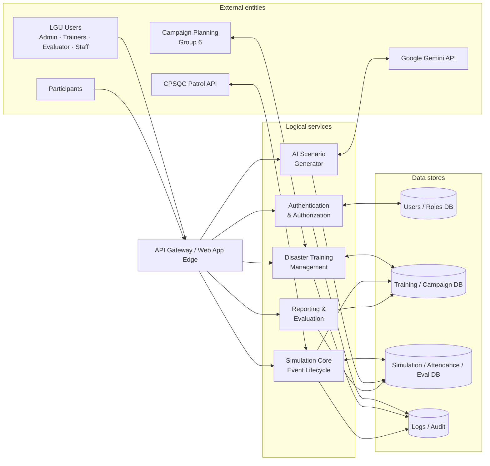

# Data Flow Diagram — Microservices View

**System:** Disaster Preparedness Training & Simulation Platform  
**Status:** Draft ready for manuscript (unchecked → completed here)

This is **not** a duplicate of classic DFD Level 0/1 only. It shows **data movement across logical services** used in the architecture narrative (Auth, Training, Simulation, AI, Reporting) plus external systems.

---

## 1. Narrative

Client requests enter through the web application / API edge (presented as an API Gateway in architecture docs). The Authentication service establishes identity and role. Training and Campaign data flow to/from the Training store and, when submitted, to Campaign Planning (Group 6). Simulation Core reads plans, hazard profiles, and templates, then writes event lifecycle and attendance/evaluation outcomes. The AI Scenario Generator sends prompts to Gemini and stores generated scenario content. Reporting aggregates evaluation and training metrics for dashboards and certificates.

---

## 2. Microservices data-flow diagram

---

## 3. Major data flows (table for manuscript)

| # | From | To | Data (examples) |
|---|------|-----|-----------------|
| 1 | User | Auth | Credentials / session / role claims |
| 2 | Auth | Gateway | Authorized identity, permissions |
| 3 | Trainer | Training Mgmt | Module content, campaign request payload |
| 4 | Training Mgmt | Group 6 | Campaign planning fields, registration metadata |
| 5 | Group 6 | Training Mgmt | Approve / reject status + notes |
| 6 | Lead Trainer | Simulation Core | Exercise plan, template id, readiness flags |
| 7 | Simulation Core | Hazard / profile data | Barangay hazards, supporting docs refs |
| 8 | Simulation Core ↔ AI | Scenario prompts / generated scenario JSON |
| 9 | AI ↔ Gemini | Prompt + model response |
| 10 | Evaluator / system | Reporting | Scores, attendance, certificates inputs |
| 11 | Simulation Core ↔ CPSQC | Patrol / marshal request data (when enabled) |

---

## 4. Level mapping (if adviser asks)

| Classic DFD | This document |
|-------------|----------------|
| Level 0 | Entire platform as one process vs externals |
| Level 1 | Processes inside one monolith app |
| **Microservices DFD** | **Same Level-1 ideas, drawn as service boundaries + stores** |

---

## 5. Suggested caption

**Figure __.** Data Flow Diagram of Microservices in the Disaster Preparedness Training and Simulation Platform.

### Paragraph

The microservices data-flow diagram illustrates how information moves among authentication, training management, simulation, AI scenario generation, and reporting. External partners such as Campaign Planning and optional CPSQC exchange bounded payloads with the training and simulation services. Persistent stores hold users, training/campaign records, and simulation results, while Gemini is invoked only by the AI scenario path. This view supports the claim that the system is modular: each service owns a clear data responsibility even when deployed together on the Laravel application host for the LGU pilot.

---

## 6. Defense talking points

1. Distinguish **logical services** vs physical servers.  
2. Gemini traffic is isolated to the AI path.  
3. Group 6 is pull/approve integration, not a shared database.  
4. Evaluation data lands in reporting for measurable drills (BDRRM gap).
