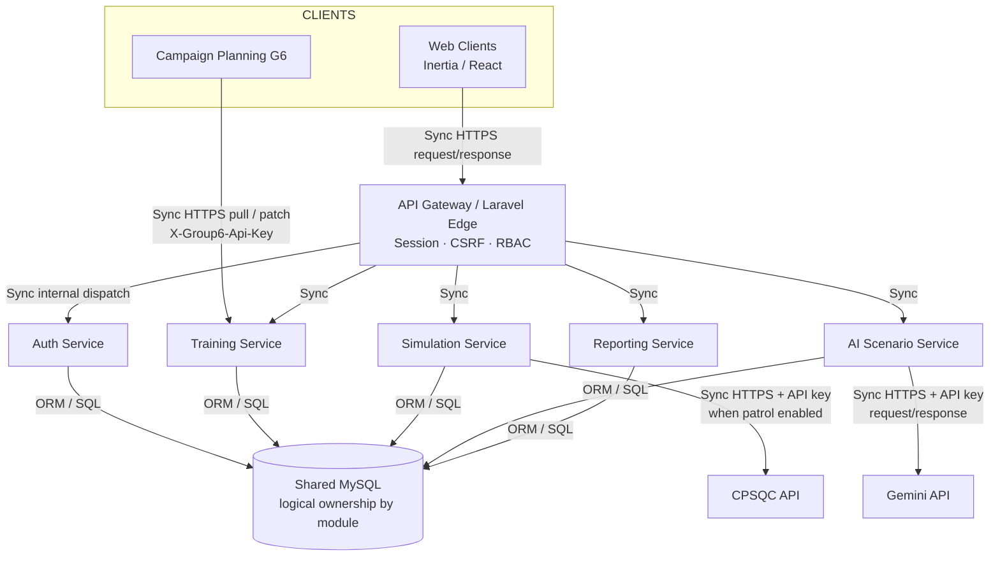
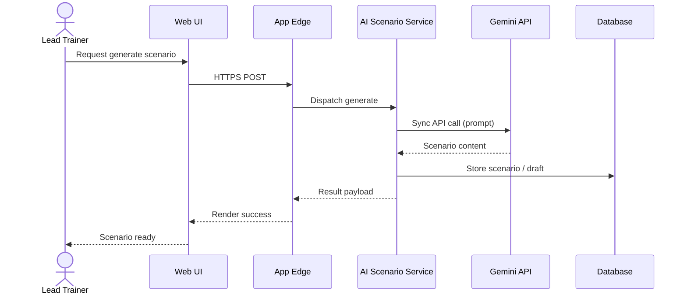

# Communication Pattern for Microservices

**System:** Disaster Preparedness Training & Simulation Platform  
**Status:** Draft ready for manuscript (unchecked → completed here)

---

## 1. Purpose

This figure explains **how services talk** — not only what boxes exist. For defense, name the pattern on each arrow:

| Pattern | Meaning in this project |
|---------|-------------------------|
| Synchronous request/response (REST/HTTP) | Browser or partner calls an endpoint and waits for JSON/HTML |
| API Gateway / edge routing | Single public entry; routes to logical modules/services |
| External API integration | Outbound call to Gemini or CPSQC with API key |
| Partner pull + status patch | Group 6 lists campaign requests then patches approve/reject |
| Shared-database style (modular monolith) | Laravel modules share one MySQL in production deploy |

---

## 2. Communication pattern diagram

---

## 3. Pattern map (who uses what)

| Interaction | Pattern | Sync/Async | Notes |
|-------------|---------|------------|-------|
| User ↔ Web App | Request/Response | Sync | Inertia pages + form posts / XHR |
| App ↔ Auth checks | In-process / policy | Sync | Spatie roles / PortalAuth gates |
| Training ↔ Group 6 | REST pull + PATCH status | Sync | Partner-driven integration |
| AI module ↔ Gemini | REST outbound | Sync | Scenario generation |
| Simulation ↔ CPSQC | REST outbound | Sync | Optional patrol marshals |
| Services ↔ MySQL | DB access | Sync | One DB; logical service ownership |
| Notifications | App events / DB notifications | Sync (+ queued if configured) | Portal notification factory |

**No message-broker (Kafka/Rabbit) required for the current pilot** — state that clearly if asked. Future scale could add async events for notifications and reporting.

---

## 4. Sequence sketch — AI scenario (supports this pattern)

---

## 5. Suggested caption

**Figure __.** Communication Patterns among Microservices of the Disaster Preparedness Training Platform.

### Paragraph

Services in the platform communicate primarily through synchronous HTTPS request/response via the application edge, which enforces authentication and role-based access. Training management exposes partner APIs so Campaign Planning can pull requests and push approval decisions. The AI scenario path calls Gemini synchronously and persists results for simulation planning. Optional CPSQC calls follow the same outbound API pattern. Persistence uses a shared MySQL database with logical ownership by module, which fits the LGU deployment model while preserving a clear microservices communication story for documentation and defense.

---

## 6. Defense talking points

1. **Sync REST** is intentional for transactional LGU workflows.  
2. Gateway/edge = security + routing, not a separate Netflix-style mesh.  
3. External systems never write directly to our DB.  
4. Async message bus is a **future enhancement**, not a missing requirement for pilot.
