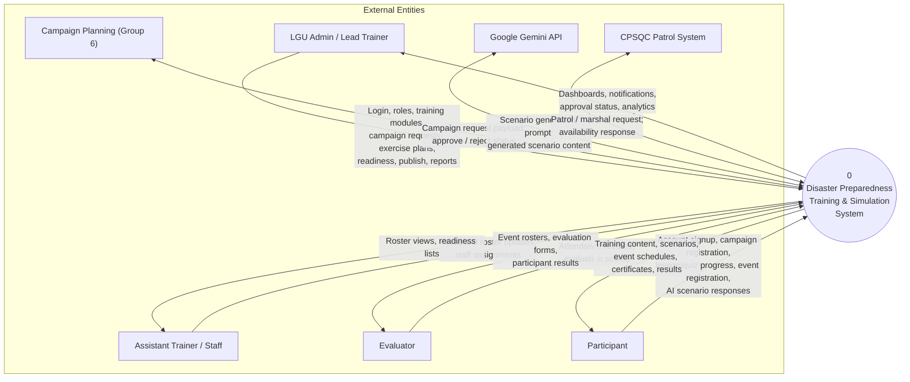

# DFD Level 0 — Context Diagram

**System:** Disaster Preparedness Training & Simulation Platform (AlertaraQC)  
**Notation:** Gane–Sarson (Process 0 = whole system; external entities = rectangles)  
**Pilot:** Barangay San Agustin, Quezon City  
**Status:** Level 0 complete · Level 1 = next step

---

## 1. What Level 0 shows

Level 0 treats the **entire platform as one process** (`0`). It answers: *Who talks to the system, and what data moves in/out?*

It does **not** show internal modules, databases, or microservices — those belong in **Level 1**.

---

## 2. Context diagram (Mermaid — for preview)

Copy to [mermaid.live](https://mermaid.live) or use the Draw.io file for the thesis figure.

---

## 3. External entities

| # | Entity | Role in Level 0 |
|---|--------|-----------------|
| 1 | **LGU Admin / Lead Trainer** | Full operations: modules, campaigns, exercise plans, publish, monitoring |
| 2 | **Assistant Trainer / Staff** | Personnel/roster support (no full ops) |
| 3 | **Evaluator** | Attendance + scoring for drills |
| 4 | **Participant** | Campaign enroll, study modules, register for events, receive certificates |
| 5 | **Campaign Planning (Group 6)** | External partner: pull campaign requests, return approve/reject |
| 6 | **Google Gemini API** | External AI: scenario generation |
| 7 | **CPSQC Patrol System** | External partner: patrol marshal requests (when enabled) |

---

## 4. Data flows (manuscript table)

| Flow ID | From | To | Data (label on arrow) |
|---------|------|-----|------------------------|
| F1 | LGU Admin / Lead Trainer | System | Login credentials, user/role management, training module content, campaign submission, exercise plan, readiness checklist, publish command |
| F2 | System | LGU Admin / Lead Trainer | Dashboards, audit logs, campaign status, event lifecycle status, reports, notifications |
| F3 | Assistant Trainer / Staff | System | Personnel roster updates, staff assignment data |
| F4 | System | Assistant Trainer / Staff | Assigned personnel lists, roster views |
| F5 | Evaluator | System | Attendance check-in/out, evaluation scores, remarks |
| F6 | System | Evaluator | Published event details, participant roster, evaluation criteria |
| F7 | Participant | System | Registration profile, campaign enrollment, lesson completion, quiz answers, AI scenario responses, simulation event registration |
| F8 | System | Participant | Training modules, lesson content, generated scenarios, event schedule, attendance confirmation, certificate / results |
| F9 | Campaign Planning | System | Campaign approve/reject decision, scheduling metadata |
| F10 | System | Campaign Planning | Campaign request payload, registration metadata, training intelligence |
| F11 | Gemini API | System | Generated scenario text / structured content |
| F12 | System | Gemini API | Scenario prompt, hazard/context parameters |
| F13 | CPSQC Patrol | System | Marshal availability, patrol request status |
| F14 | System | CPSQC Patrol | Patrol request, exercise/event context |

---

## 5. Suggested manuscript caption

**Figure __.** Data Flow Diagram Level 0 (Context Diagram) of the Disaster Preparedness Training and Simulation System.

### Paragraph (paste under figure)

The Level 0 data flow diagram presents the disaster preparedness training and simulation platform as a single process and shows how external entities exchange information with it. LGU administrators and lead trainers submit training content, campaign requests, and simulation plans; participants enroll in campaigns, complete modules, and register for events; evaluators record attendance and scores; and external systems such as Campaign Planning, Google Gemini, and CPSQC Patrol exchange bounded API payloads. This context view establishes the system boundary before the Level 1 decomposition into major internal processes and data stores.

---

## 6. Defense talking points

1. **One bubble** = whole system boundary — honest for a modular Laravel deploy.  
2. **Seven externals** — real actors/partners, not generic “User”.  
3. **Bidirectional flows** where data returns (reports, approvals, AI response).  
4. Level 1 next will **explode Process 0** into Auth, Training, Simulation, Evaluation, etc.

---

## 7. Draw.io file

Open and export PNG/PDF:

`Documents/09_DFD_Level_0_Context.drawio`

---

## Next: Level 1

When ready, Level 1 will decompose Process **0** into:

1. Authentication & User Management  
2. Training & Campaign Management  
3. Simulation Event Lifecycle  
4. Participant Registration & Attendance  
5. Evaluation & Certification  
6. Hazard Assessment  
7. Reporting & Notifications  

Plus data stores: Users DB, Training DB, Simulation DB, etc.
