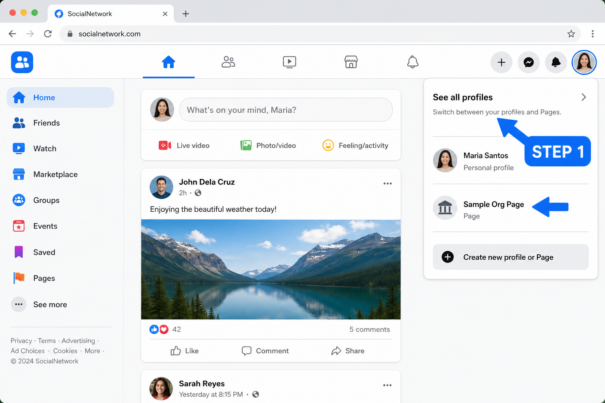
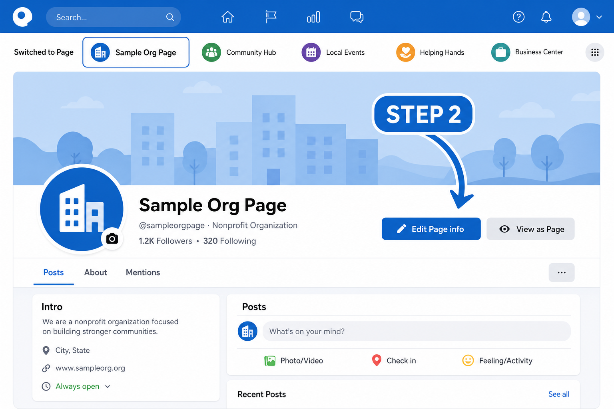
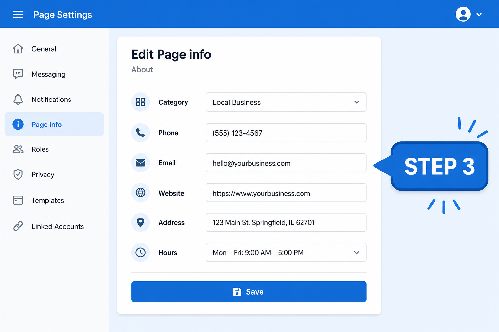
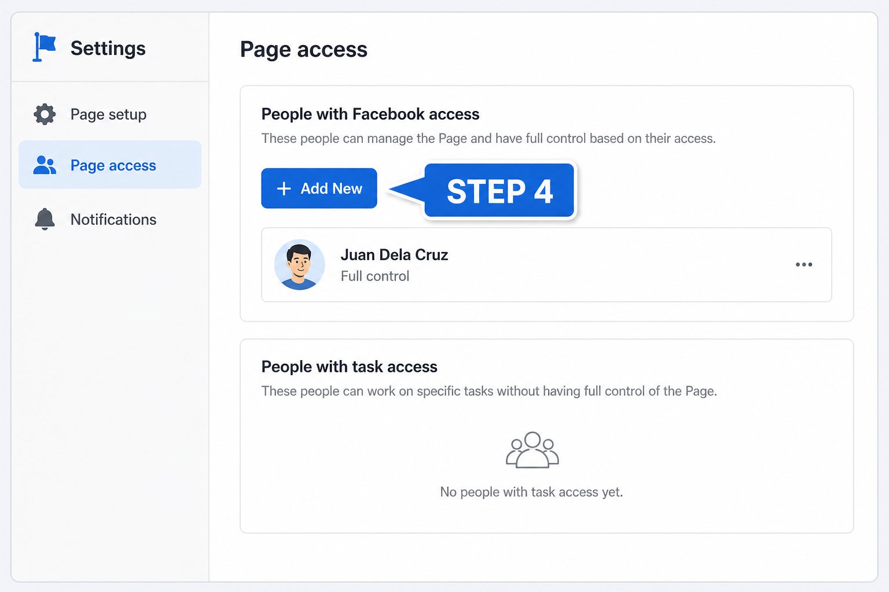
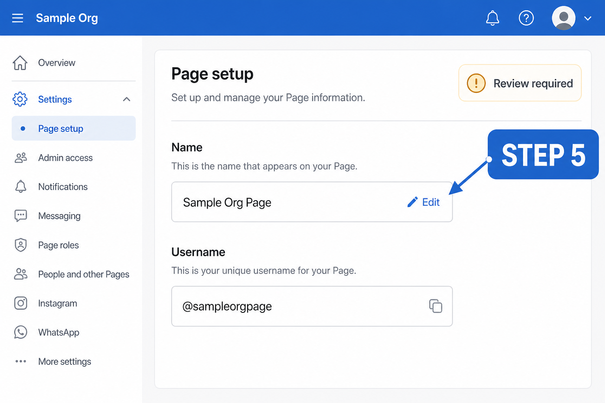
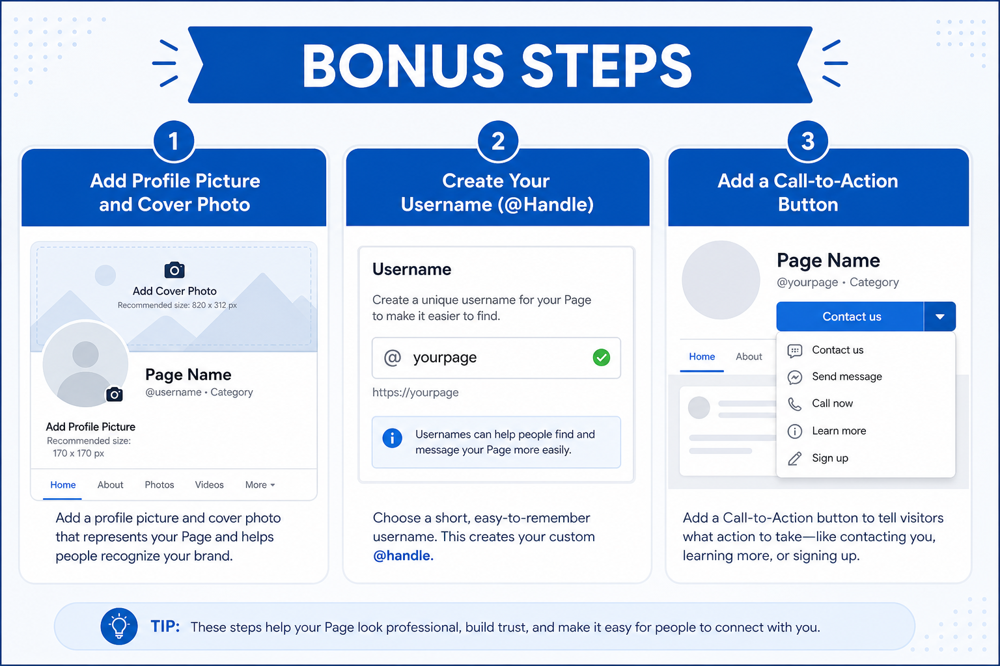

# Facebook Page Guide (Taglish) — Existing Page

**Para sa:** video tutorial (isa-isang step)  
**Assumption:** may existing Facebook Page ka na  
**Note:** Sample pictures lang ito (mockup). Pwede magiba ang exact labels sa Facebook UI, pero pareho ang landmarks (profile switcher, Edit Page info, Settings, Page access, Page setup).

---

## Paano gamitin sa video

| Segment | Ano i-record |
|--------|----------------|
| Intro (10–15s) | “May existing Page tayo — ituturo ko kung saan makikita, maglalagay ng details, magdadagdag ng authority, at magpapalit ng name.” |
| Per step | Screen recording + picture sa guide bilang B-roll / thumbnail |
| Outro | Checklist + reminder: Full control lang ang pwedeng mag-change ng name at mag-add ng access |

---

## Quick map (buod)

1. Hanapin at i-switch ang Page  
2. Buksan ang **Edit Page info**  
3. I-fill out ang details (About / contact / address)  
4. Mag-add ng **authority** (Page access)  
5. Palitan ang **Page name** (kung kailangan)  
6. Bonus: photo, username, CTA button, privacy  

---

## STEP 1 — Saan mo makikita ang Page mo?

### Ano gagawin
1. Mag-login sa Facebook gamit ang personal account mo (desktop recommended).  
2. I-click ang **profile photo** mo sa **kanan itaas**.  
3. I-click ang **See all profiles**.  
4. Piliin ang **Page** mo sa listahan.  
5. Kapag napili, mag-switch ang buong Facebook papunta sa **Page profile** (hindi na personal account ang “nagsasalita”).

### Alternatibong daan
- Sa left menu / shortcuts, hanapin ang **Pages**, then open your Page.  
- O i-type sa search bar ang exact Page name.

### Ano i-show sa screen
Profile menu → **See all profiles** → click your Page.

### Sample script (Taglish)
> “Una, hanapin natin yung Page. Click lang yung profile photo sa taas, then **See all profiles**. Dito lalabas yung Page mo — click mo para mag-switch.”

### Picture (reference)



**Video tip:** Mag-pause ng 2 segundos habang naka-highlight ang Page name sa list.

---

## STEP 2 — I-switch muna bago mag-edit

### Bakit importante
Maraming settings **hindi lalabas** kung personal account ka pa. Kailangan **naka-switch ka as the Page**.

### Paano malalaman na naka-switch ka na
- Profile photo sa kanan itaas = **logo / avatar ng Page**  
- Name sa top = **Page name**, hindi personal name  
- Kapag magpo-post, as the Page ka magpo-post

### Ano i-show
Before/after: personal avatar → Page avatar.

### Sample script
> “Important: bago tayo mag-edit, siguraduhing **naka-switch tayo as the Page**. Kung personal account pa, hindi complete yung options.”

### Picture (reference)



---

## STEP 3 — Saan maglalagay ng details (Page info)?

### Ano gagawin
1. Habang naka-switch as Page, pumunta sa Page mo (Feed / profile ng Page).  
2. Hanapin ang button na **Edit Page info** (malapit sa cover photo), **o**  
3. Pumunta sa tab / section na **About**, then **Edit**.  
4. I-update ang details:

| Field | Ano ilalagay (example) |
|-------|-------------------------|
| Category | Organization / Education / Community, etc. |
| Phone | Landline o mobile ng office |
| Email | Official email (hindi personal kung possible) |
| Website | Official site o link |
| Address | Physical address kung may office |
| Hours | Open hours (kung applicable) |
| Description / Bio | Short intro kung ano ang Page |

5. I-save / Confirm.

### Via Settings (alternate)
1. Click Page photo (kanan itaas) → **Settings & privacy** → **Settings**  
2. Hanapin **Page setup** / Page info  
3. I-edit ang fields doon

### Ano i-show
Edit Page info form — category, contact, address, hours.

### Sample script
> “Para sa details: click **Edit Page info**. Dito mo ilalagay yung category, phone, email, website, address, at short description. Completein niyo ito para madaling mahanap at magtiwala ang audience.”

### Picture (reference)



**Video tip:** Mag-scroll slow sa form. Fill out 1–2 sample fields live.

---

## STEP 4 — Saan magdadagdag ng authority (Page access)?

### Maikling explanation (bago mag-demo)
Sa New Pages Experience, hindi na “Admin / Editor / Moderator” ang labels. Ngayon:

| Type | Meaning (simple) |
|------|------------------|
| **Facebook access — Full control** | Parang **Admin**. Pwedeng mag-manage ng settings, mag-add/remove ng tao, even delete the Page. |
| **Facebook access — Partial control** | Pwedeng mag-manage as Page, pero **limited** sa settings/access. |
| **Task access** | Para sa specific tasks (content, ads, insights) via Meta Business Suite — **hindi** sila fully “switch into” the Page tulad ng Facebook access. |

**Reminder:** Ikaw dapat may **Full control** para makapag-add ng iba.

### Ano gagawin
1. Switch into your Page.  
2. Click Page photo (kanan itaas) → **Settings & privacy** → **Settings**.  
3. Sa left side, hanapin **Page access** (minsan under New Pages Experience).  
4. Under **People with Facebook access**, click **Add New**.  
5. Search by **name** o **email** ng Facebook account nila.  
6. Decide:
   - Full control ON = trusted co-admin only  
   - Full control OFF = partial control  
7. Click **Give Access** → enter password → Confirm.  
8. Sabihin sa tao na **i-accept** ang invitation (Notifications).

### Para sa Task access
Sa same **Page access** screen → **People with task access** → **Add New** → piliin kung ano ang pwedeng i-manage (content, messages, ads, insights, etc.).

### Ano i-show
Settings → Page access → Add New → Full control toggle.

### Sample script
> “Para magdagdag ng authority: Settings → **Page access**. Dito may **Facebook access** at **Task access**. Kung gusto mong full admin-level, i-on ang **Full control** — pero ingat, kasi same power nila sayo. Pagkatapos, kailangan i-accept nila yung invite.”

### Picture (reference)



**Safety tip (sabihin on cam):** Huwag magbigay ng Full control sa random / bagong kakilala.

---

## STEP 5 — Saan magpapalit ng Page name?

### Ano gagawin
1. Switch into your Page (Full control required).  
2. Page photo → **Settings & privacy** → **Settings**.  
3. Click **Page setup**.  
4. Click **Name** (or Edit beside Name).  
5. Under General Page Settings, **Edit** beside your Page name.  
6. Type new name → **Review Change**.  
7. Enter password → **Request Change**.  
8. Maghintay ng review (minsan hours, minsan hanggang ~3 days).

### Important notes
- **Name ≠ Username.** Pag palit ng name, **hindi automatic** nagbabago ang `@username` / URL.  
- Malaking rebrand = mas matagal ang review; minsan may documentation request.  
- May cooldown minsan bago ka pwedeng magbago ulit — double-check spelling.

### Ano i-show
Page setup → Name → Edit → Review Change.

### Sample script
> “Kung gusto mong palitan ang Page name: Settings → **Page setup** → **Name** → Edit. I-type ang bagong name, then **Review Change**. May review si Facebook, so hindi instant always. Tandaan: pag palit ng name, hindi automatic napapalitan ang username.”

### Picture (reference)



---

## STEP 6 — Bonus extras (dagdag value sa video)

### Picture (overview)



### 6A. Profile picture + Cover photo
1. Habang as Page, open your Page profile.  
2. Click camera / edit icon sa profile picture → Upload.  
3. Same sa cover photo.  
4. Use clear logo + readable cover (brand + short tagline).

**Script:** “Update din ang profile at cover photo — first impression ito kapag naghahanap ang tao.”

### 6B. Username (@handle) / web address
1. Settings → **Page setup** → **Name** / Username section.  
2. **Edit** beside username.  
3. Choose available `@yourpage` (usually desktop only).  
4. Save.

**Script:** “Username ang `@handle` at facebook.com/username — mas madaling i-share kaysa long link.”

### 6C. Call-to-action (CTA) button
1. On your Page profile, look for **Add a button** / edit action button.  
2. Choose: Contact us, Learn more, Sign up, Call now, etc.  
3. Link to website / form / Messenger / phone.  
4. Save.

**Script:** “Lagyan ng CTA button para one-click ang next action — call, website, o message.”

### 6D. Who can post / privacy basics
1. Settings → look for **Audience and visibility** / Page moderation / posting permissions.  
2. Decide kung public followers lang ba ang pwedeng mag-post sa Page, o admin-only posts.  
3. Review blocked words / messaging settings if needed.

**Script:** “I-check din kung sino pwedeng mag-post o mag-message — para controlled ang Page.”

### 6E. Meta Business Suite shortcut (optional clip)
- Pumunta sa [business.facebook.com](https://business.facebook.com)  
- Select your Page (top-left selector)  
- Settings → Page info / access — useful kung hindi makita ang option sa regular Facebook UI

**Script:** “Kung kulang ang option sa Facebook, subukan ang Meta Business Suite — same Page, mas complete ang tools.”

---

## Video checklist (bago mag-upload)

- [ ] Step 1: Show See all profiles → select Page  
- [ ] Step 2: Confirm naka-switch as Page  
- [ ] Step 3: Edit Page info (fill 2–3 fields live)  
- [ ] Step 4: Page access → explain Full vs Task access  
- [ ] Step 5: Page setup → Name change + review note  
- [ ] Bonus: photo / username / CTA (kahit short)  
- [ ] Outro: “Full control = careful; accept invite; name ≠ username”

---

## Troubleshooting (mabilis)

| Problema | Try this |
|----------|----------|
| Walang Edit / walang Page access | Hindi ka naka-switch as Page, o wala kang Full control |
| Hindi makapag-change ng name | Task access lang ang role mo; kailangan Facebook access with Full control |
| Hindi makita ang Page sa list | Search the Page name, or check if you’re logged into the correct personal account that manages it |
| Invite hindi natanggap | Sabihin sa tao i-check Notifications / email; re-send access if needed |
| UI iba sa video | Normal — Meta updates UI; sundin ang keywords: **See all profiles**, **Edit Page info**, **Page access**, **Page setup** |

---

## File map (para sa editor)

```
docs/facebook-page-guide/
├── facebook-page-guide-taglish.md   ← script + steps
└── images/
    ├── step-01-hanapin-page.png
    ├── step-02-edit-page-info.png
    ├── step-03-page-details.png
    ├── step-04-page-access.png
    ├── step-05-change-name.png
    └── step-06-bonus-extras.png
```

Kapag nagre-record: open Facebook live + gamitin ang pictures bilang intro card per segment (hal. “STEP 4 — Page Access” overlay).
