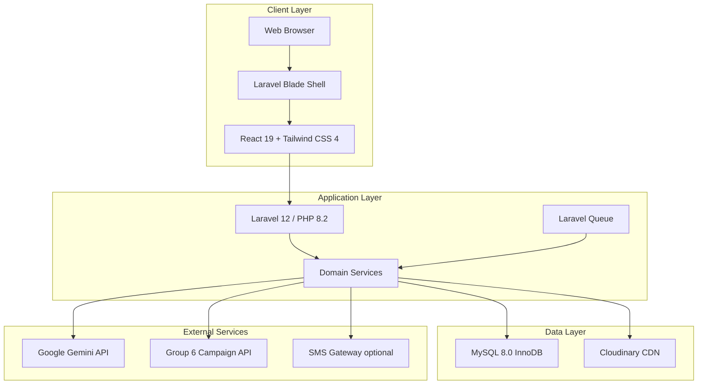

# 10.2 Tools and Technologies Used

**Disaster Preparedness Training & Simulation System**  
**Pilot site:** Barangay San Agustin, Quezon City  
**Production URL:** https://disaster-training.alertaraqc.com  
**Last updated:** 2026-08-14

This section documents the software, frameworks, libraries, and tools used to design, develop, test, deploy, and document the system. Values reflect the **`my-app/`** codebase (`composer.json`, `package.json`, deployment docs).

---

## Summary (thesis paragraph — copy-paste ready)

**Backend:** PHP 8.2, Laravel Framework 12, Laravel Eloquent ORM, Laravel Queue, Laravel Mail, Laravel HTTP Client (Guzzle).  
**Frontend:** React 19, Laravel Blade templates, Vite 7, Tailwind CSS 4, Axios, Lucide React icons.  
**UI / UX Libraries:** Radix UI, SweetAlert2, ApexCharts, Chart.js, Motion, Lottie, html5-qrcode.  
**Database:** MySQL 8.0 with InnoDB engine (production); MariaDB 12 / SQLite (local development and automated testing).  
**AI Integration:** Google Gemini API (Generative Language API) via Laravel HTTP Client.  
**File & Media:** Cloudinary (training/lesson assets), smalot/pdfparser (PDF text extraction).  
**External Integrations:** Group 6 Campaign System API; optional SMS gateway (Twilio/Vonage).  
**Authentication & Security:** Session-based authentication, role-based access control (RBAC), database-backed sessions, audit logging.  
**Testing:** Pest PHP, PHPUnit, Postman (API and manual testing).  
**DevOps & Deployment:** Git, GitHub, Composer, NPM, Node.js, Hostinger VPS, Apache, cPanel/SSH, Admin Deployment module.  
**Development Environment:** Cursor AI, Visual Studio Code, XAMPP, Docker Compose (MariaDB, Adminer, Mailpit).  
**Documentation & Diagrams:** Draw.io (diagrams.net), Mermaid, Markdown, PHP + ZipArchive (thesis/docx generation scripts).  
**Methodology:** Agile Scrum (Sprint-based development).

---

## Table 10.2 — Tools and Technologies Used

| Category | Tool / Technology | Version | Purpose |
|----------|-------------------|---------|---------|
| **Programming Language** | PHP | 8.2+ | Server-side application logic, API endpoints, business services |
| **Programming Language** | JavaScript (ES Modules) | ES2022+ | Frontend interactivity and SPA-style UI |
| **Programming Language** | JSX | — | React component syntax |
| **Programming Language** | TypeScript | 5.7 | Static type-checking for frontend code (`tsc --noEmit`) |
| **Backend Framework** | Laravel | 12 | MVC architecture, routing, middleware, ORM, queues, mail |
| **Frontend Library** | React | 19 | Component-based user interface |
| **Frontend Runtime** | React DOM | 19 | DOM rendering and hydration |
| **View Layer** | Laravel Blade | — | Server-rendered page shells; mounts React entry points |
| **Architecture Pattern** | Blade + Vite + React | — | Hybrid SPA: Blade templates load React bundles via `@vite` (not Inertia.js) |
| **Build Tool** | Vite | 7 | Frontend bundling, HMR, production builds |
| **Build Plugin** | Laravel Vite Plugin | 2 | Integrates Vite with Laravel asset pipeline |
| **Build Plugin** | `@vitejs/plugin-react` | 5 | React Fast Refresh and JSX transform |
| **CSS Framework** | Tailwind CSS | 4 | Utility-first styling and responsive layout |
| **CSS Engine** | `@tailwindcss/vite` | 4 | Tailwind integration with Vite |
| **HTTP Client (Frontend)** | Axios | 1.11 | AJAX/API requests from React components |
| **HTTP Client (Backend)** | Laravel HTTP Client | — | REST calls to Gemini, Group 6, SMS, and external APIs (Guzzle under the hood) |
| **Icons** | Lucide React | 0.561 | Consistent icon set across admin and participant UI |
| **UI Primitives** | Radix UI | 1.x | Accessible dialog, scroll area, and toast components |
| **Notifications** | SweetAlert2 | 11 | Modal alerts and confirmation dialogs |
| **Charts** | ApexCharts | 6 | Dashboard and analytics visualizations |
| **Charts** | Chart.js | 4 | Supplementary chart rendering |
| **Charts (React)** | react-apexcharts, react-chartjs-2 | 2.x / 5.x | React bindings for chart libraries |
| **Animation** | Motion | 13 | UI motion and transitions |
| **Animation** | Lottie Web | 5 | Lightweight vector animations |
| **QR Code** | html5-qrcode | 2.3 | Participant attendance check-in and QR scanning |
| **Floating UI** | `@floating-ui/dom` | 1.7 | Tooltip and popover positioning |
| **Database (Production)** | MySQL | 8.0 | Primary relational database; InnoDB storage engine |
| **Database (Local Dev)** | MariaDB | 12.1 | Optional local DB via Docker Compose |
| **Database (Testing)** | SQLite | — | In-memory database for PHPUnit/Pest test runs |
| **ORM** | Laravel Eloquent | — | Database models, relationships, and query builder |
| **Migrations & Seeders** | Laravel Artisan | — | Schema versioning and demo/test data |
| **DB Admin (Local)** | Adminer | latest | Web-based database management in Docker |
| **AI Platform** | Google Gemini API | v1beta | AI scenario generation, quiz generation, lesson content assistance |
| **AI Models** | gemini-2.0-flash, gemini-2.5-flash, gemini-2.5-pro | — | Preferred generative models (`GeminiService`) |
| **Cloud Storage** | Cloudinary | SDK 3.x | Upload and serve training lesson images/videos |
| **PDF Processing** | smalot/pdfparser | 2.12 | Extract text from uploaded PDF lesson resources |
| **External API** | Group 6 Campaign System | — | Inbound campaign planning and approved campaign sync |
| **SMS (Optional)** | Twilio / Vonage | — | OTP and notification delivery (`SmsService`) |
| **Authentication** | Laravel Session Auth | — | Login, logout, session persistence |
| **Authorization** | RBAC (custom roles/permissions) | — | Role-gated routes and features per user type |
| **Session Store** | Database sessions | — | Server-side session records with inactivity timeout |
| **Email (Production)** | Laravel Mail (SMTP) | — | Verification, notifications, admin alerts |
| **Email (Local Dev)** | Mailpit | latest | Capture and inspect outbound mail in Docker |
| **Queue** | Laravel Queue | — | Background jobs (AI generation, backups, async tasks) |
| **Testing Framework** | Pest PHP | 3.8 | Primary PHP test runner |
| **Testing Framework** | PHPUnit | 11 | Unit and feature test suites |
| **API Testing** | Postman | — | Manual and collection-based API endpoint testing |
| **Code Quality** | ESLint | 9 | JavaScript/React linting |
| **Code Quality** | Prettier | 3 | Code formatting |
| **Code Quality** | Laravel Pint | 1.24 | PHP code style enforcement |
| **Debugging** | Laravel Debugbar | 3.16 | Local request/query debugging (dev only) |
| **Fake Data** | FakerPHP | 1.23 | Test and seeder data generation |
| **Version Control** | Git | — | Source code management |
| **Repository Hosting** | GitHub | — | Remote repository and collaboration |
| **PHP Package Manager** | Composer | 2.x | PHP dependency management |
| **JS Package Manager** | NPM | 10.x | Node.js dependency management |
| **Runtime** | Node.js | 22.x | Vite build toolchain |
| **Web Server (Production)** | Apache | — | Hostinger VPS web server |
| **Hosting** | Hostinger VPS | — | Production deployment environment |
| **Server Management** | cPanel / SSH | — | File management, PHP config, deployment |
| **Deployment** | Admin Deploy module | — | In-app Git pull + Laravel/npm build steps |
| **CI/CD (Optional)** | GitHub Actions | — | Documented as optional automated deploy pipeline |
| **Local Dev Stack** | XAMPP | — | Apache + MySQL + PHP for Windows local development |
| **Containerization** | Docker Compose | 3.8 | Local MariaDB, Adminer, and Mailpit services |
| **Process Runner** | Concurrently | 9 | Runs `artisan serve`, queue worker, and Vite dev server together |
| **IDE** | Visual Studio Code | — | Primary code editor |
| **AI-Assisted Dev** | Cursor AI | — | AI-assisted coding and documentation |
| **API Documentation** | Markdown + Postman | — | Endpoint reference and integration guides |
| **Process Diagrams** | Draw.io (diagrams.net) | — | BPMN, DFD, BPA, Use Case diagrams |
| **Flow Diagrams** | Mermaid | — | CI/CD and architecture diagrams in docs |
| **Thesis Documents** | PHP + ZipArchive | — | DOCX patch/generation scripts under `Documents/` |
| **Methodology** | Agile Scrum | — | Sprint planning, backlog, increment delivery |

---

## Technology Stack by Layer

---

## Notes for Thesis / Documentation

1. **Frontend architecture:** The system uses **Laravel Blade + React via Vite**, not Inertia.js. Blade renders the page shell; React mounts on designated DOM roots (`app.jsx`, `auth.jsx`, etc.).
2. **Database environments:** Production uses **MySQL 8.0 (InnoDB)**. Local development may use XAMPP MySQL, Docker MariaDB, or SQLite (tests only).
3. **AI integration:** Gemini is called through **`GeminiService`** using Laravel's HTTP client against `generativelanguage.googleapis.com`.
4. **Authentication:** Session-based login with RBAC — not token-based SPA auth (Sanctum is not used in this project).
5. **Production server:** Project deployment docs specify **Apache on Hostinger VPS** (not Nginx).
6. **GitHub Actions:** Referenced in CI/CD documentation as an **optional** future pipeline; no active workflow file is committed yet.

---

## Related Documentation

- `CI_CD_PIPELINE.md` — development to Hostinger deployment flow
- `GOING_LIVE_AND_DEPLOYMENT.md` — production deployment steps
- `API_GATEWAY_TABLE.md` — gateway endpoint reference
- `SYSTEM_MODULE_INTEGRATIONS.md` — internal and external module integrations
