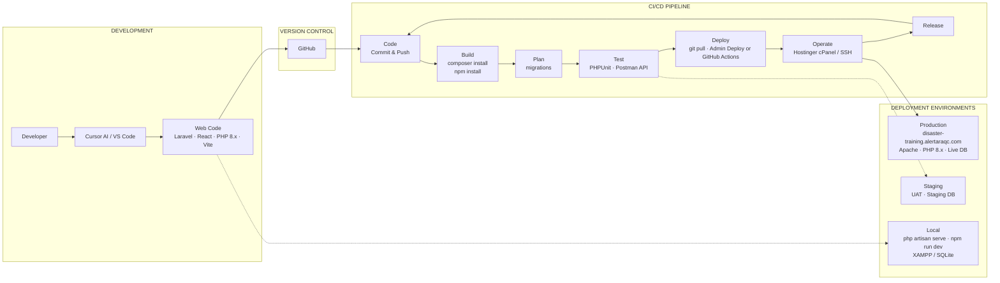

# CI/CD Pipeline — Disaster Preparedness Training & Simulation System

Visual presentation of the pipeline from **code creation (Cursor AI, VS Code)** to **deployment (Hostinger)**.

**Key technologies:** Cursor · VS Code · Git · GitHub · Laravel 12 · PHP 8.x · Node.js · Vite · Postman · Hostinger · cPanel (or SSH)

---

## Pipeline overview (Mermaid)

Copy the block below into any Mermaid-supported viewer (GitHub, VS Code with Mermaid extension, or [mermaid.live](https://mermaid.live)) to render the diagram.

---

## Linear pipeline (simplified)

```mermaid
flowchart LR
    subgraph Development
        D[Developer]
        IDE[Cursor / VS Code]
        CODE[Laravel + React<br/>PHP 8.x · Vite]
        D --> IDE --> CODE
    end

    subgraph VersionControl
        GIT[Git]
        GH[GitHub]
        GIT --> GH
    end

    subgraph Build
        C[composer install]
        N[npm install<br/>npm run build]
        C --> N
    end

    subgraph Deploy
        PULL[git pull]
        ART[php artisan migrate<br/>config:clear · cache:clear]
        PULL --> ART
    end

    subgraph Production
        H[Hostinger<br/>cPanel / SSH]
        LIVE[disaster-training.alertaraqc.com]
        H --> LIVE
    end

    CODE --> GIT
    GH --> C
    N --> PULL
    ART --> H
```

---

## Stage summary

| Stage | What happens |
|-------|----------------------|
| **Development** | Code in Cursor AI or VS Code (Laravel, React/JSX, PHP 8.x, Vite). Local run: `php artisan serve`, `npm run dev`. |
| **Version control** | Commit and push to Git → GitHub (or your repo). |
| **Build** | On server or in CI: `composer install`, `npm install`, `npm run build`. |
| **Plan** | `php artisan migrate --force` (and optional `db:seed`). |
| **Test** | PHPUnit, Postman for API; optional staging/UAT. |
| **Deploy** | **Option A:** Admin Deployment page (Git pull → Laravel & Build). **Option B:** SSH `git pull` then run Artisan + npm. **Option C:** GitHub Actions → Hostinger (if configured). |
| **Operate** | Hostinger: cPanel file manager, PHP settings, or SSH. |
| **Release** | Live at https://disaster-training.alertaraqc.com. |

---

## Deployment options on Hostinger

1. **Manual (SSH):** `cd /var/www/html/.../my-app` → `git pull` → `php artisan migrate --force` → `npm run build` (and clears as in Admin Deploy).
2. **Admin Deployment buttons:** Log in as LGU Admin → Deployment → Run Git Pull, then Run Laravel & Build (set `DEPLOY_*_PATH` in `.env` if needed).
3. **GitHub Actions (optional):** Add `.github/workflows/deploy.yml` to run on push and deploy to Hostinger via SSH or Hostinger API.

For a printable or slide-ready visual, open `docs/CI_CD_PIPELINE.html` in a browser or export the Mermaid diagrams from [mermaid.live](https://mermaid.live).
